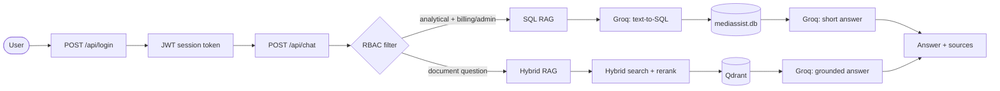
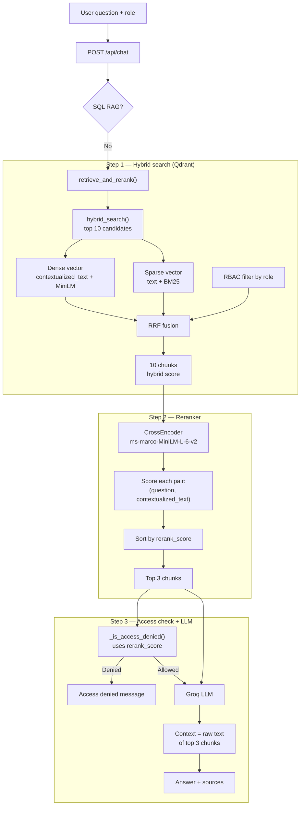

# MediBot RAG

MediBot is a **role-aware hospital assistant** for MediAssist staff. Users sign in as a doctor, nurse, billing executive, technician, or admin and ask natural-language questions about hospital operations.

**What it is used for:**

- **Clinical & nursing guidance** — treatment protocols, diagnostic references, ICU procedures, infection control
- **Billing & claims help** — ICD-10 codes, claim submission steps, pre-auth SLAs, escalation rules
- **Equipment & general policies** — equipment manuals, leave policy, code of conduct, staff handbook
- **Claims analytics** — SQL-backed answers for billing/admin roles (e.g. pending claims by department)

Answers are grounded in ingested hospital documents (hybrid RAG) or the claims database (SQL RAG). Access is enforced by role — a doctor cannot read billing-only documents, and only billing executives and admins can run analytics queries.

Built with **hybrid document RAG** (dense + BM25 + rerank), **SQL RAG**, **RBAC**, a **FastAPI** backend, and a **Next.js** frontend.

## Architecture



**Query flow**

1. **Login** — user signs in; backend returns a JWT with `role`.
2. **Chat** — frontend sends `question` + `role` with Bearer token.
3. **RBAC** — document search filters Qdrant by collection access; SQL RAG is limited to `billing_executive` and `admin`.
4. **Retrieval** — analytical questions → SQL RAG; everything else → hybrid RAG (10 retrieve → 3 rerank → LLM).
5. **Response** — `{ answer, retrieval_type, role, sources }`.

### Document RAG pipeline (hybrid search + reranker)



## Prerequisites

- Python 3.11+
- [uv](https://github.com/astral-sh/uv) (recommended) or pip
- Node.js 18+
- Docker (for Qdrant)

## API keys & environment

**Backend** — copy the sample env file and add your Groq key:

```bash
cp .env.example .env
```

Edit `.env`:

```bash
GROQ_API_KEY=your_groq_api_key_here
```

Get a Groq API key at [console.groq.com](https://console.groq.com).

**Frontend** — optional; copy if you need a local env file:

```bash
cp frontend/.env.local.example frontend/.env.local
```

Leave `NEXT_PUBLIC_API_URL` unset so `/api/*` is proxied to the backend.

## Setup

```bash
cd medibot-rag
uv sync
```

### Qdrant

```bash
docker run -d --name qdrant -p 6333:6333 qdrant/qdrant
```

### Ingest documents

Indexes files under `data/` into the `medibot_hybrid` Qdrant collection:

```bash
uv run python -m chunker.ingest
```

## Run

**Terminal 1 — backend**

```bash
uv run uvicorn index:app --reload --port 8000
```

Uses variables from `.env` if present (or export `GROQ_API_KEY` in your shell).

API: `http://localhost:8000` · Docs: `http://localhost:8000/docs`

**Terminal 2 — frontend**

```bash
cd frontend
npm install
npm run dev
```

App: `http://localhost:3000/login`

Restart `npm run dev` after changing `frontend/next.config.ts`.

## Demo credentials (For demo/testing purposes)

| Username | Password   | Role              | Access |
|----------|------------|-------------------|--------|
| `billing` | `billing123` | billing_executive | Billing docs + SQL analytics |
| `doctor`  | `doctor123`  | doctor            | Clinical + nursing + general docs |
| `nurse`   | `nurse123`   | nurse             | Nursing + general docs |
| `tech`    | `tech123`    | technician        | Equipment + general docs |
| `admin`   | `admin123`   | admin             | All collections + SQL analytics |

## API endpoints

| Method | Path | Auth | Description |
|--------|------|------|-------------|
| `POST` | `/api/login` | No | Returns JWT + role |
| `POST` | `/api/chat` | Bearer token | Question → RAG answer |
| `GET`  | `/api/collections/{role}` | No | Document collections accessible to role |
| `GET`  | `/health` | No | Health check |

**Login**

```bash
curl -X POST http://localhost:8000/api/login \
  -H "Content-Type: application/json" \
  -d '{"username":"billing","password":"billing123"}'
```

**Chat**

```bash
curl -X POST http://localhost:8000/api/chat \
  -H "Content-Type: application/json" \
  -H "Authorization: Bearer <token>" \
  -d '{"question":"How many claims are pending?","role":"billing_executive"}'
```

**Collections**

```bash
curl http://localhost:8000/api/collections/doctor
```

## RBAC collections

| Collection | Roles |
|------------|-------|
| billing | billing_executive, admin |
| clinical | doctor, admin |
| nursing | nurse, doctor, admin |
| equipment | technician, admin |
| general | all roles |

SQL RAG (`claims`, `maintenance_tickets`) is available only to **billing_executive** and **admin**.

## Project structure

```
medibot-rag/
├── api/                 # FastAPI routes (auth, chat, RAG)
├── chunker/             # Docling chunking, hybrid search, rerank, ingest
├── sql_rag/             # Text-to-SQL over mediassist.db
├── data/                # Documents + SQLite DB
├── frontend/            # Next.js UI
├── index.py             # FastAPI app entry
└── readme.md
```

## Example questions

- **SQL RAG** (billing/admin): *"How many nephrology claims are pending?"*
- **Hybrid RAG** (doctor): *"What is the outbreak management protocol?"*
- **Access denied** (doctor): *"What is the cashless pre-auth SLA?"* (billing-only doc)

## Security

**Demo only — not production-ready.** Hardcoded users, plaintext passwords, and a default JWT secret are intentional for local testing and portfolio use.

### Before pushing to GitHub

```bash
git status
grep -rE "gsk_|GROQ_API_KEY=[^<]" . \
  --exclude-dir=node_modules --exclude-dir=.venv --exclude="*.example"
```

Confirm:

- [ ] `.env` and `frontend/.env.local` are **not** tracked (see `.gitignore`)
- [ ] Only `.env.example` is committed, with placeholders — no real `GROQ_API_KEY`
- [ ] `frontend/node_modules/` and `frontend/.next/` are not tracked
- [ ] Rotate any API key that was ever committed by mistake

### Secrets

| Variable | Required locally | In repo |
|----------|------------------|---------|
| `GROQ_API_KEY` | Yes | Never — use `.env` |
| `JWT_SECRET_KEY` | No (dev default) | Never — set in production deploy env |

### If you deploy for real

- Replace demo auth with a real identity provider and hashed passwords
- Set a strong random `JWT_SECRET_KEY`
- Disable or protect `/docs` in production
- Restrict CORS to your frontend domain
- Treat SQL RAG as untrusted input (LLM-generated SQL; read-only DB today)
